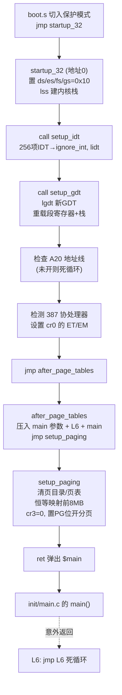

# head.s 运行流程分析

head.s 是内核从引导跳进来后、进入 C 语言 `main()` 之前的最后一段汇编。
核心任务：**重建 `IDT/GDT`、验证硬件、开启分页，然后跳进 `main()`**。

## 执行流程分步解析

### ① 入口 `startup_32`（线性地址 0）

`boot.s` 切到保护模式后跳到这里。`pg_dir` 和 `startup_32` 是同一地址（之后会被页目录覆盖）。

```asm
startup_32:
	movl $0x10,%eax		# 内核数据段选择子
	mov %ax,%ds
	mov %ax,%es ... %fs ... %gs
	lss stack_start,%esp	# 建立内核栈
```

先把 `ds/es/fs/gs` 都设为内核数据段 `0x10`（boot.s 里那张临时 GDT 的数据段），再用 `lss` 建立内核栈。

### ② 重建中断描述符表 `call setup_idt`

`setup_idt` 把 **256 个 IDT 表项**全部指向 `ignore_int`（默认空中断处理），然后 `lidt` 加载。
此时中断还没开，只是先占好位，具体处理程序由后续各模块自行安装。

### ③ 重建全局描述符表 `call setup_gdt`

`setup_gdt` 用 `lgdt gdt_descr` 加载 head.s 里**自己的新 GDT**（不再用 boot.s 那张临时的）。
加载后必须**重新装载所有段寄存器**，因为 GDT 变了：

```asm
	call setup_gdt
	movl $0x10,%eax		# reload all the segment registers
	mov %ax,%ds ... %es ... %fs ... %gs
	lss stack_start,%esp	# 栈也重新加载
```

### ④ 验证 A20 地址线

自增一个值写入地址 0，比较地址 0 和 0x100000（1MB）是否相同。
若相同说明 A20 没打开（高位地址回绕），死循环卡住；不同则说明 A20 正常，能访问 1MB 以上。

```asm
	xorl %eax,%eax
1:	incl %eax
	movl %eax,0x000000
	cmpl %eax,0x100000
	je 1b			# 相等=A20没开，卡在这里
```

### ⑤ 检测数学协处理器（387）

读 `cr0`，检查 ET 位判断有没有 387；没有就设置 EM（模拟）位。

### ⑥ `jmp after_page_tables`

跳过中间那些页表预留空间（`pg0`@0x1000、`pg1`@0x2000、`pg2`@0x3000），
到达 `0x4000` 处的 `after_page_tables`，为调用 `main` 做栈准备：

```asm
after_page_tables:
	pushl $0		# main 的参数 envp/argv/argc
	pushl $0
	pushl $0
	pushl $L6		# main 万一返回时的返回地址
	pushl $main		# 关键：把 main 地址压栈，当"返回地址"
	jmp setup_paging
```

### ⑦ `setup_paging` 开启分页

这是 head.s 的重头戏：

1. 把页目录 + 3 张页表区域（`1024*3` 项）清零；
2. 设置页目录前两项，分别指向 `pg0`、`pg1`（`+7` = 存在/可读写/用户）；
3. **倒着填**页表，恒等映射前 **8MB**（虚拟地址=物理地址）；
4. `cr3 = 0`（页目录基址，正好是 `pg_dir`）；
5. 置 `cr0` 的 PG 位 → **正式开启分页**；
6. `ret`。

```asm
	movl %eax,%cr3		/* cr3 = 0 = pg_dir，页目录基址 */
	movl %cr0,%eax
	orl $0x80000000,%eax
	movl %eax,%cr0		/* 置 PG 位，开启分页 */
	ret			/* 顺便刷新预取队列 */
```

### ⑧ `ret` → 跳进 `main()`

`setup_paging` 的 `ret` 弹出栈顶——正是第 ⑥ 步压入的 `$main`——于是「返回」到了
`init/main.c` 的 `main()`。这是 Linus 用 `push+ret` 实现跳转的巧妙手法（还能刷新分页开启后的预取队列）。
若 `main` 意外返回，会落到 `L6: jmp L6` 死循环。

## 一个关键设计：代码被后续数据覆盖

head.s 顶部注释强调：启动代码在地址 0，而**页目录也在地址 0**，`setup_paging` 建页目录时会
**覆盖掉 startup 代码**；同理 `setup_idt`/`setup_gdt` 会被 `pg0/pg1` 页表覆盖。
这没问题，因为它们都是「一次性」代码，用完即弃。

## 控制流图


