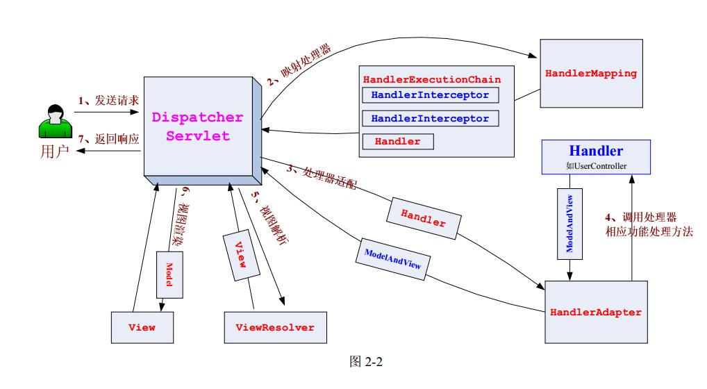

# Spring MVC 整体运行流程和架构
{docsify-updated}

## Http请求的旅程
<center></center>

## 整体运行流程


看 `DispatcherServlet` 的 `doDispatch` 方法：

    protected void doDispatch(HttpServletRequest request, HttpServletResponse response) throws Exception {
		HandlerExecutionChain mappedHandler = null;
		ModelAndView mv = null;
		Exception dispatchException = null;

        // 调用HandlerMapping获取HandlerExecutionChain
        HandlerExecutionChain mappedHandler = getHandler(processedRequest);
        
        // 为Handler找到合适的HandlerAdapter
        HandlerAdapter ha = getHandlerAdapter(mappedHandler.getHandler());

        //调用HandlerExecutionChain中所有HandlerInterceptor的preHandle方法
        if (!mappedHandler.applyPreHandle(processedRequest, response)) {
            return;
        }

        // Actually invoke the handler.
        mv = ha.handle(processedRequest, response, mappedHandler.getHandler());

        if (asyncManager.isConcurrentHandlingStarted()) {
            return;
        }
        applyDefaultViewName(processedRequest, mv);

        //调用HandlerExecutionChain中所有HandlerInterceptor的postHandle方法
        mappedHandler.applyPostHandle(processedRequest, response, mv);		
        processDispatchResult(processedRequest, response, mappedHandler, mv, dispatchException);
	}

## 组件分析
上图中可以看出，Spring MVC主要包括： `HandlerMapping` 、 `HandlerExecutionChain` 、 `HandlerAdapter` 、 `ModelAndView` 、 `ViewResolver` 、 `HandlerExceptionResolver。` 

### HandlerMapping
`HandlerMapping` 接口有一个核心方法：
```
public interface HandlerMapping {
    ...
    @Nullable HandlerExecutionChain getHandler(HttpServletRequest request) throws Exception;
}
```
返回一个 `HandlerExecutionChain` 对象，所以 `HandlerMapping` 主要作用就是为请求找到一个合适的处理器 `Handler` 来处理这个请求.  `Handler` 总是被包装成 `HandlerExecutionChain` 对象。

关注Spring内置的 `RequestMappingHandlerMapping`

### HandlerExecutionChain
`HandlerExecutionChain` 主要包含以下几个成员：
```
public class HandlerExecutionChain{
    ...
    private final Object handler;
	private List<HandlerInterceptor> interceptorList;

    boolean applyPreHandle(HttpServletRequest request, HttpServletResponse response) throws Exception{...}
    void applyPostHandle(HttpServletRequest request, HttpServletResponse response, @Nullable ModelAndView mv){...}
    void triggerAfterCompletion(HttpServletRequest request, HttpServletResponse response, @Nullable Exception ex) {...}
    ...
}
```
一个处理请求的 `handler` 以及一些用来拦截请求的 `HandlerInterceptor` 对象。当 `DispatcherServlet` 对象处理请求时，在调用 `handler` 的处理方法之前，首先会调用  `HandlerExecutionChain`的 `applyPreHandle` 方法，该方法会调用 `interceptorList` 数组中的所有 `HandlerInterceptor` 的 `preHandle` 方法。

当 `handler` 处理完请求之后， `HandlerExecutionChain`的 `applyPostHandle` 方法，该方法会调用 `interceptorList` 数组中的所有 `HandlerInterceptor` 的 `postHandle` 方法。

### HandlerAdapter
`HandlerAdapter` 是为了适配所有不同种类的 `handler` ， `HandlerExecutionChain` 中的 `handler` 是 `Object` 类型的，处理请求的对象有很多种，比如有 `Controller` 、 `Servlet` 、 `POJO Bean` 等，这些处理器有不同的处理方法来处理请求，不可能再 `DispatcherServlet` 为所有类型做判断，调用相应的处理方法。

假设，我们写了一个自定义的类 `Foo` 来处理请求，这个处理请求的方法是 `foo(reqeust,response)` , Spring 不会去写类似于判断这个处理器的类型是不是 `Foo` ，如果是，就调用 `foo(...)` 方法来处理请求这种代码。因为这样每次新增新的处理器类型或者方法时就要修改 Spring 的代码，没有扩展性。

因此 Spring 使用一个适配器，将所有的请求处理方法都统一成一个接口：
```
public interface HandlerAdapter {
    boolean supports(Object handler);
    ModelAndView handle(HttpServletRequest request, HttpServletResponse response, Object handler) throws Exception;
}
```
因此，在 `DispatcherServlet` 种就可以用一行代码：
```
mv = ha.handle(processedRequest, response, mappedHandler.getHandler());
```
应对所有处理器。

有了这个接口，上例中，我们就可以为 `Foo` 写一个 `FooHandlerAdapter` 适配器，并在适配器的 `handle(...)` 方法中调用 `foo(...)` 处理请求，当然也可以增加其他自定义处理逻辑。这样 Spring 就可以支持扩展了。

关注 `RequestMappingHandlerAdapter`

### ModelAndView
`ModelAndView` 的主要成员：
```
public class ModelAndView {
	/** View instance or view name String. */
	private @Nullable Object view;

	/** Model Map. */
	private @Nullable ModelMap model;

	/** Optional HTTP status for the response. */
	private @Nullable HttpStatusCode status;

	/** Indicates whether this instance has been cleared with a call to {@link #clear()}. */
	private boolean cleared = false;
}
```

### ViewResolver
`ViewResolver` 用来解析 `View` 对象，当 `ModelAndView` 中的 `view` 成员不是直接的 `View` 对象，而是字符串时，需要根据这个字符串去解析出真正的 `View` 对象。


### HandlerExceptionResolver

当 handler 处理抛出异常时， `DispatcherServlet` 在下面函数中使用 `HandlerExceptionResolver` 来处理异常：

    protected ModelAndView processHandlerException(HttpServletRequest request, HttpServletResponse response,
			@Nullable Object handler, Exception ex) throws Exception {
		// Check registered HandlerExceptionResolvers...
		ModelAndView exMv = null;
		if (this.handlerExceptionResolvers != null) {
			for (HandlerExceptionResolver handlerExceptionResolver : this.handlerExceptionResolvers) {
				exMv = handlerExceptionResolver.resolveException(request, response, handler, ex);
				if (exMv != null) {
					break;
				}
			}
		}
			return exMv;
	}
因此，我们可以实现 `HandlerExceptionResolver` 接口来统一处理业务代码抛出的异常。